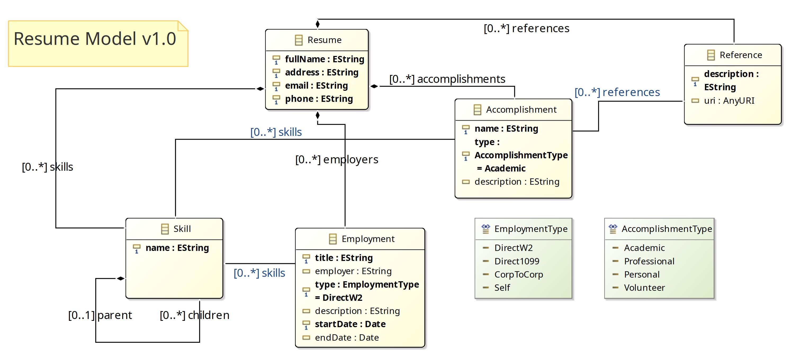
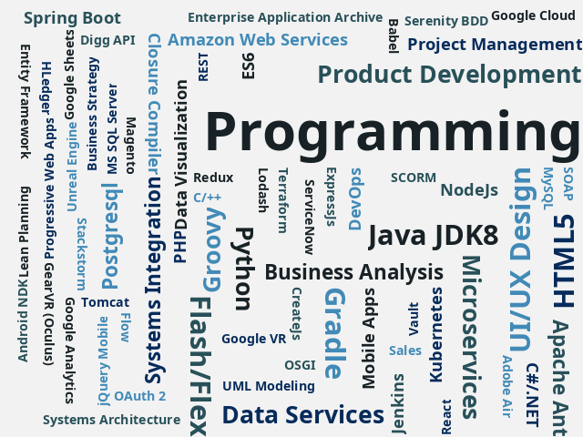

# Resume - Aaron R Miller

This project contains all sources and public resources used in the publication of my personal resume. 

You most likely found your way here by following a link to my code sample. If this is the case than pleasant greetings and welcome to you! Please see bellow for an overview of this project as a "Code Sample".

If you have found you way here looking for examples on how to publish your own resume data in multiple formats, please feel free to use any of this code as you see fit, without any expectation of attribution beyond the provided `LCENSE` file in the project root. If you have an idea how how to improve this project than please feel free to open an Issue or PR with your thoughts.

## Value Proposition

Before starting any new project, one must first consider the underlying value proposition as defined by the project goals. There are many capable OSS and COTS products intended to solve the problem of format-agnostic document publication, and so that is not the primary focus of this project. Rather, this project intends to provide a mechanism for publishing meaningful and objective insights over the sea of data points accumulated by professionals over the course of a long and vibrant career.

## Features

### Domain Model

TODO...

### Data Visualizations

TODO...

### Gradle Plugin

TODO...

