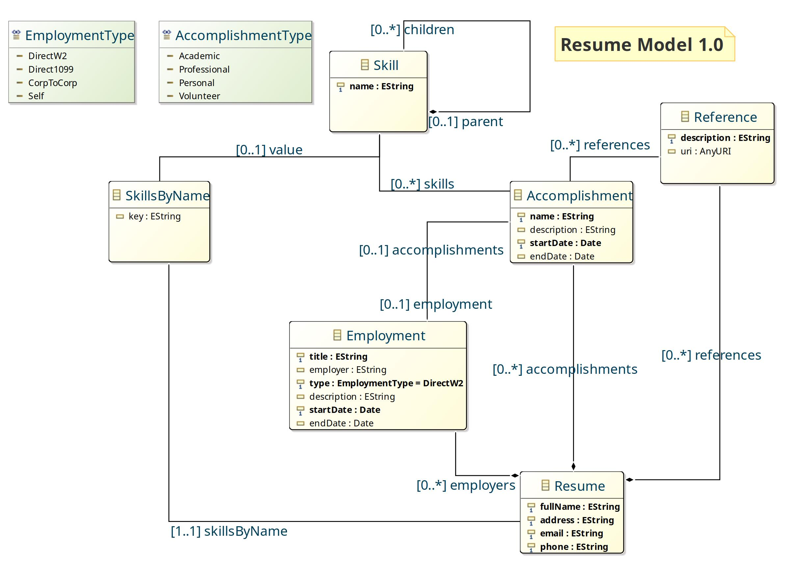

# Resume - Aaron R Miller

Greetings,

This project contains all of the source data and tools used in the publication of my resume. If you are here looking for a copy of this document, the latest version can be downloaded from [here](public/drkstr101.resume-1.0.0.pdf).

## Project Goals

The goal of this project is to provide a mechanism for objectively measuring skill development over the course of a professional career, along with publishing tools to output meaningful representations of that data.

This project is currently in the MVP release stage, with the focus on establishing a domain model and skill point calculator which may be used utilized for publication tasks.

## Domain Model

The intent of the `Resume` domain model is to collect a list of accomplishments along with the skills used during that event. This information is then used to build a histogram of Skill Points over time.

## Gradle Plugin

The final document is produced through a custom [Gradle Resume Plugin](https://github.com/drkstr101/gradle-resume). Currently, this plugin is responsible for collecting the resume data to build up the domain model, which is then used to generate a word cloud image from the skill points and to publish a LaTex document for the final result. Additional features may be added down the road. Feature requests and contributions welcome!
